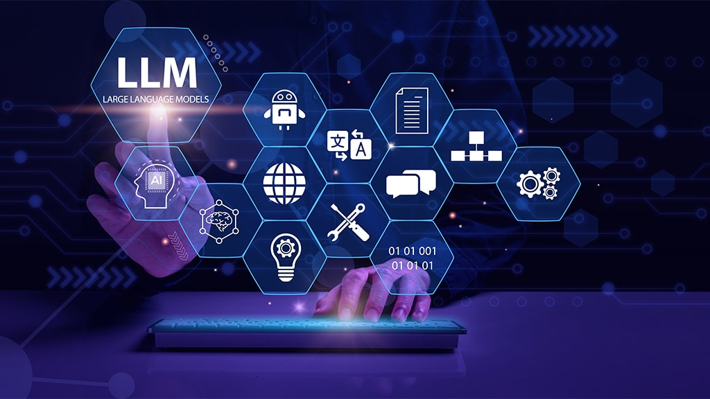

# Transformers & Large Language Models - From Theory to Production




## 📚 About This Course

A comprehensive, hands-on training program covering the evolution of Natural Language Processing from classical methods to modern Large Language Models, Retrieval-Augmented Generation (RAG), fine-tuning techniques, Model Context Protocol (MCP), and autonomous AI agents.

**Author:** Bassem Ben Hamed
**Affiliation:** Professor of Applied Mathematics at Sfax University & Tech Lead at Digital Innovation Partner
**Repository:** [https://github.com/bassambhamed/llm-theory-to-production](https://github.com/bassambhamed/llm-theory-to-production)

**Target Audience:** Academic Researchers, Data Scientists, Software Engineers, AI/ML Practitioners, and Technical Managers.

**Format:** Mixed theoretical lectures with practical hands-on labs.

## 🎯 Learning Objectives

By completing this course, participants will:

1. ✅ Understand the evolution from classical NLP to modern LLMs
2. ✅ Master Transformer architectures and their variants
3. ✅ Build production-ready RAG systems
4. ✅ Apply fine-tuning techniques (LoRA, QLoRA, DPO)
5. ✅ Implement standardized tool integration with MCP
6. ✅ Design and deploy autonomous AI agent systems
7. ✅ Evaluate and optimize LLM performance

## 📋 Course Structure

| Part | Topic | Labs | Status |
|------|-------|------|--------|
| [Part 1](./part-01-nlp-fundamentals/) | NLP Fundamentals | Lab 1: Classical NLP Techniques | ✅ Available |
| [Part 2](./part-02-rnn-to-transformers/) | From RNNs to Transformers | Lab 2: RNN-Based Models · Lab 3: Transformer Classification & Seq2Seq | ✅ Available |
| [Part 3](./part-03-llms/) | From Transformers to LLMs | Lab 4: Foundation Models · Lab 5: Prompt Engineering & Function Calling | ✅ Available |
| [Part 4](./part-04-rag/) | Retrieval-Augmented Generation | Lab 6: Building Production RAG Systems | ✅ Available |
| Part 5 | Fine-Tuning & Adaptation | Lab 7: Fine-Tuning with PEFT Methods | 🔜 Coming Soon |
| Part 6 | Model Context Protocol (MCP) | Lab 8: Custom MCP Implementations | 🔜 Coming Soon |
| Part 7 | Agentic AI | Lab 9: Building Production Agents | 🔜 Coming Soon |

---

### Part 1: NLP Fundamentals
- Introduction to NLP: core tasks, challenges, and historical evolution
- Text representation: tokenization, Bag-of-Words, TF-IDF
- Word embeddings: Word2Vec, GloVe, FastText
- Evaluation metrics: Precision, Recall, F1, Perplexity, BLEU, ROUGE
- **Labs:** Text preprocessing, TF-IDF classification, Word2Vec training

### Part 2: From RNNs to Transformers
- LSTM architecture: gates, cell state, gradient flow
- Sequence-to-Sequence models with attention (Encoder-Decoder)
- Vanishing gradient problem (empirical demonstration)
- Transformer architecture: self-attention, multi-head attention, positional encoding
- Fine-tuning BERT for classification, T5 for summarization and translation
- Attention visualization and interpretation
- Tokenization strategies: BPE, WordPiece, SentencePiece
- **Labs:** LSTM sentiment classification, Seq2Seq translation, BERT fine-tuning, tokenizer comparison

### Part 3: From Transformers to Large Language Models
- GPT family evolution (GPT-1 → GPT-4o) and open-source LLMs (LLaMA, Mistral, Phi, Gemma, Qwen)
- Scaling laws, emergent abilities, and multimodal models
- Pre-training pipeline, next-token prediction, and decoding strategies
- Prompt engineering: zero-shot, few-shot, Chain-of-Thought, Tree-of-Thoughts
- Function calling, structured outputs, and tool integration
- **Labs:** Foundation model interaction, prompt engineering, function calling workflows

### Part 4: Retrieval-Augmented Generation (RAG)
- RAG architecture and foundations (Lewis et al. 2020)
- Embedding models and vector databases (Chroma, Pinecone, Weaviate, FAISS)
- Document chunking strategies and hybrid search (BM25 + vector)
- Reranking, query transformations, and HyDE
- GraphRAG and Agentic RAG
- RAG evaluation with Ragas (Faithfulness, Relevancy, Precision, Recall)
- **Labs:** Document ingestion, chunking comparison, "Chat with your Data" app, hybrid search, GraphRAG, Ragas evaluation

### Part 5: Fine-Tuning & Adaptation
- Supervised Fine-Tuning (SFT)
- Parameter-Efficient Fine-Tuning (LoRA, QLoRA)
- Alignment techniques (RLHF, DPO)
- Model evaluation and deployment
- **Labs:** Fine-tuning with PEFT methods

### Part 6: Model Context Protocol (MCP)
- Standardized LLM-tool integration
- Building MCP servers and clients
- **Labs:** Custom MCP implementations

### Part 7: Agentic AI
- Agent foundations and reasoning
- LangChain, LangGraph orchestration
- Multi-agent systems
- **Labs:** Building production agents

## 🛠️ Technology Stack

| Category | Tools |
|----------|-------|
| **Languages** | Python 3.11+ |
| **Deep Learning** | PyTorch, Hugging Face Transformers |
| **NLP** | NLTK, scikit-learn, Gensim, Tokenizers |
| **LLM APIs** | OpenAI API, Anthropic API |
| **RAG** | LangChain, LlamaIndex, ChromaDB, FAISS |
| **Fine-Tuning** | PEFT, LoRA, QLoRA, TRL |
| **Agents** | LangGraph, MCP SDK |
| **Environment** | Jupyter Lab, Conda |

## 🚀 Getting Started

### 1. Clone the repository

```bash
git clone https://github.com/bassambhamed/llm-theory-to-production.git
cd llm-theory-to-production
```

### 2. Create the environment

```bash
conda create -n llm python=3.11 -y
conda activate llm
pip install -r requirements.txt
```

### 3. Launch Jupyter

```bash
jupyter lab
```

### 4. Navigate to the first part

Open `part-01-nlp-fundamentals/notebooks/` and start with the first notebook.

## 📁 Repository Structure

```
llm-theory-to-production/
├── README.md                          # This file
├── requirements.txt                   # Global dependencies
├── part-01-nlp-fundamentals/          # Classical NLP techniques
│   ├── README.md
│   ├── notebooks/
│   └── slides/
├── part-02-rnn-to-transformers/       # RNNs, LSTMs, Transformers, BERT, T5
│   ├── README.md
│   ├── notebooks/
│   └── slides/
├── part-03-llms/                      # LLMs, prompt engineering, function calling
│   ├── README.md
│   ├── notebooks/
│   └── slides/
├── part-04-rag/                       # RAG pipelines and evaluation
│   ├── README.md
│   ├── notebooks/
│   ├── slides/
│   └── rag-app/
├── part-05-finetuning/                # SFT, LoRA, QLoRA, RLHF, DPO (coming soon)
├── part-06-mcp/                       # Model Context Protocol (coming soon)
└── part-07-agentic-ai/               # Autonomous agents (coming soon)
```

## 📋 Prerequisites

- **Python** 3.11 or higher
- **Hardware:** GPU recommended for Parts 2–5 (CUDA-compatible)
- **API Keys:** OpenAI and/or Anthropic (for Parts 3–7)
- **Knowledge:** Basic Python programming, linear algebra fundamentals, machine learning concepts

## 📚 Key References

| Paper | Year | Relevance |
|-------|------|-----------|
| Mikolov et al. — Word2Vec | 2013 | Part 1 |
| Hochreiter & Schmidhuber — LSTM | 1997 | Part 2 |
| Vaswani et al. — Attention Is All You Need | 2017 | Part 2 |
| Devlin et al. — BERT | 2019 | Part 2 |
| Raffel et al. — T5 | 2020 | Part 2 |
| Brown et al. — GPT-3 | 2020 | Part 3 |
| Wei et al. — Chain-of-Thought Prompting | 2022 | Part 3 |
| Lewis et al. — RAG | 2020 | Part 4 |
| Hu et al. — LoRA | 2021 | Part 5 |
| Rafailov et al. — DPO | 2023 | Part 5 |

## 📄 License

This project is licensed under the MIT License — see the [LICENSE](LICENSE) file for details.

## 👤 Author

**Bassem Ben Hamed**
- Professor of Applied Mathematics — Sfax University (ENETCOM)
- Tech Lead — Digital Innovation Partner
- GitHub: [@bassambhamed](https://github.com/bassambhamed)

---

> *"The best way to understand LLMs is to build with them — from the first tokenizer to a production agent."*
